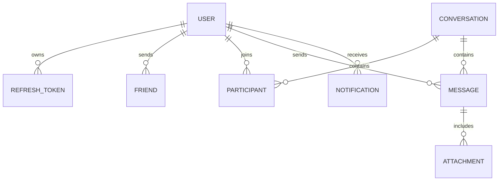

# MySQL ER diagram

```mermaid
erDiagram
  USER ||--o{ REFRESH_TOKEN : owns
  USER ||--o{ FRIEND : sends
  USER ||--o{ PARTICIPANT : joins
  CONVERSATION ||--o{ PARTICIPANT : contains
  CONVERSATION ||--o{ MESSAGE : contains
  USER ||--o{ MESSAGE : sends
  MESSAGE ||--o{ ATTACHMENT : includes
  USER ||--o{ NOTIFICATION : receives
```
